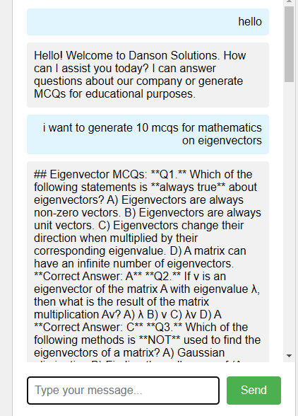
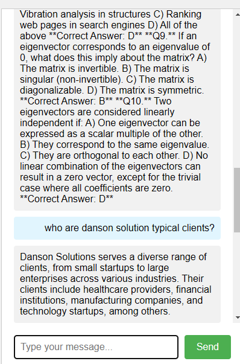
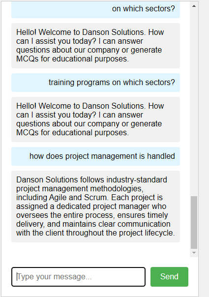

### Installation Guide
- Step 1: Clone the Repository
  - To get started, clone the repository containing the chatbot code. Open a terminal and run the following command:

              git clone https://github.com/xAJNGx/personaldocumentchatbot.git
              cd chatbot
    
- Step 2: Set Up a Virtual Environment
  - It is recommended to use a virtual environment for managing dependencies. Run the following commands:

          python3 -m venv venv
          On Windows: venv\Scripts\activate
    
- Step 3: Install Required Dependencies
  - Next, install the required Python libraries:
    
           pip install -r requirements.txt
   
- Step 4: Set Up Environment Variables
  - You will need to set up environment variables for the LLM API key (e.g., Google Gemini). Add your API key to an .env file in the root of the project:

          GEMINI_API_KEY=your_api_key_here
         
- Step 5: Set Application Default Credentials (ADC)
  - Type the following the terminal to set the credentials. You can get these by create a new project -> enable api -> create Service Account -> Create service account new key . You will get the json file.

             set GOOGLE_APPLICATION_CREDENTIALS=__.json
    
- Step 5: Run the Chatbot
  - Once the environment is set up, you can start the chatbot by running:

             python chatbot.py

### Screenshots

